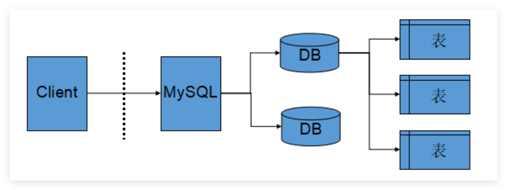
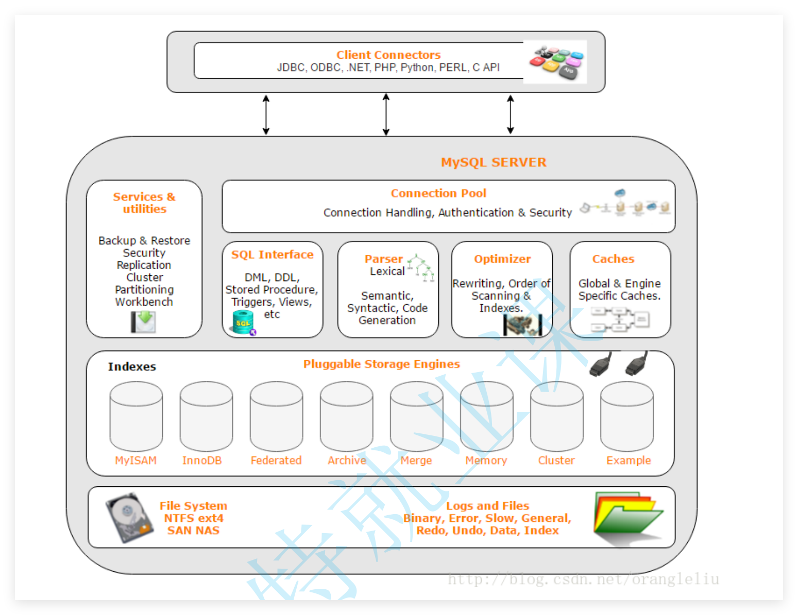
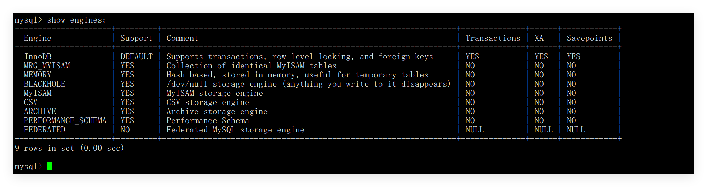
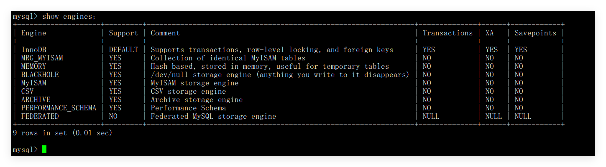
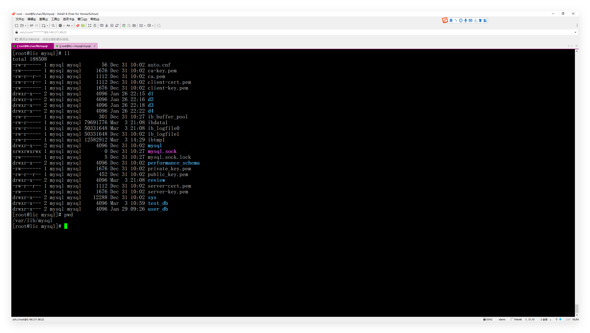
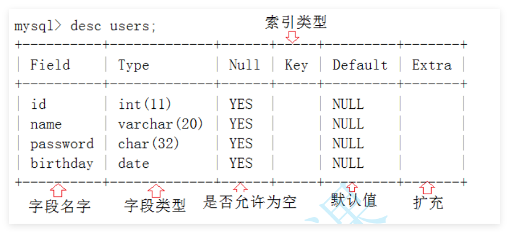
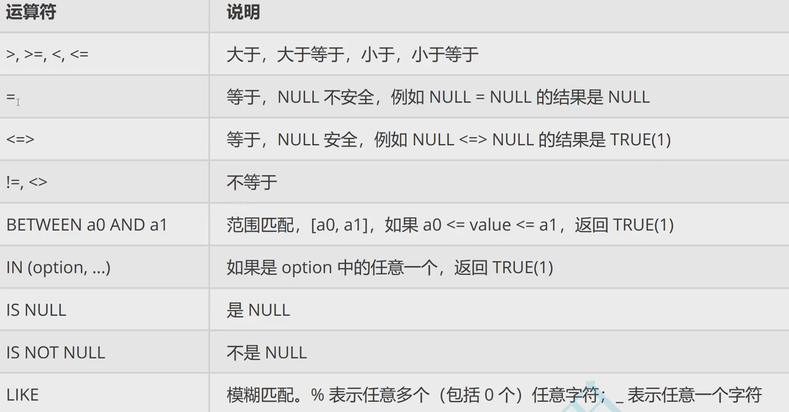
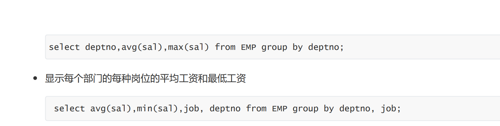
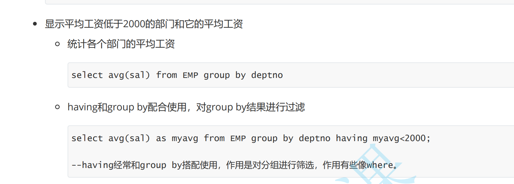

# MySql

## 1. 数据库基础

**07 数据库基础**

1. **mysql它是数据库服务的客户端**
2. **mysqld它是数据库服务的服务端。**
3. **mysq本质：基于C(mysql) S(mysqld)模式的一种网络服务**

**mysql是一套给我们提供 数据存取的网络程序。**

**数据库一般指的是：在磁盘或者内存中存储的 特定组织数据。-----  将来在磁盘上存储的一套数据库方案。**

**数据库服务---mysqld。**


**一般的文件确实提供了文件的存储能力，但是文件并没有提供非常好的数据管理能力(站在用户角度)。 c/c++文件太麻烦了。基本读写，内容没有提供。**

**数据本质：对数据内容  存储的一套解决方案。 你给我字段或者要求，我直接给你结果就行的。**

**数据库总结：：：存储解决方案的。**


**mysql    ----        mysqld ---------------  磁盘。**

**数据库的水平是衡量一个程序员水平的重要指标。**


**08 见见mysql**

**mysql的配置文件：/etc/my.cnf。 里面就有mysql的数据存放的位置。**

**1.建立数据库本质，linux下的一个目录。**

**2.数据库建表本质：linux下创建一个文件即可。**

**3.数据库本质 其实也是文件，只不过这些文件并不由程序员直接操作，而是由数据库服务帮我们操作。**

**上面的操作是mysqld帮我们做的。 SQL语句帮我们做。**


**09 主流数据库**

**mysql: 百万级千万级的并发没有压力的。mysql的生态特别好的。**

**mysql: 关系型数据库。**


**10  服务器，数据库，表**

###  1.1服务器，数据库，表关系



**mysql客户端， mysqld服务端   数据库。**

**数据库服务器：mysqld. 数据库管理系统程序。**


**11 mysql架构**

**逻辑结构：程序员眼中的数据库长什么样**。

**物理结构：数据最终在磁盘上到底怎么存。**


### 1.2MySQL架构

**mysqld: 网络结构。**



```
             Client
                │
        ┌───────▼────────┐
        │ Connector连接器 │
        └───────┬────────┘
                │
        ┌───────▼────────┐
        │   SQL Interface │
        └───────┬────────┘
                │
        ┌───────▼────────┐
        │ Parser解析器    │
        └───────┬────────┘
                │
        ┌───────▼────────┐
        │ Optimizer优化器 │
        └───────┬────────┘
                │
        ┌───────▼────────┐
        │ Executor执行器 │
        └───────┬────────┘
                │
 ┌──────────────▼──────────────┐
 │      Storage Engine         │
 │ InnoDB MyISAM Memory ...    │
 └──────────────┬──────────────┘
                │
             Disk
```

**1.客户端 2.链接器  3.SQL交互界面 4.解析器 5. 优化器 6.执行器  7.存储引擎  8.disk 。**


**12SQL语句的分类**

### 1.3SQL语句分类

**DDL【data definition language】 数据定义语言，用来维护存储数据的结构**

​	**代表指令: create, drop, alter**

**DML【data manipulation language】 数据操纵语言，用来对数据进行操作**

​	**代表指令： insert，delete，update**

​	**DML中又单独分了一个DQL，数据查询语言，代表指令： select**

**DCL【Data Control Language】 数据控制语言，主要负责权限管理和事务**

​	**代表指令： grant，revoke，commit**

**1.创建表。 2.操作表的内容。 3.权限和事务的控制。**


**13存储引擎**

### 1.4存储引擎

**SQL的存储引擎**

**这是MySQL的一个核心特性——**插件式存储引擎架构（Pluggable Storage Engine Architecture）**。**

**99% 的业务场景使用的都是 InnoDB。**

**InnoDB = Innovative Database Engine**

**show engines**





**Client**
   **↓**
**SQL 接口**
   **↓**
**解析器 (Parser)**
   **↓**
**优化器 (Optimizer)**
   **↓**
**执行器 (Executor)**
   **↓**
**存储引擎 (Storage Engine)   ← 你问的核心**
   **↓**
**磁盘文件**


**14 mysql预备：注意下面是数据库的操作。**

 ## 2.库的操作


**15创建数据库**

### 2.1创建库和基本操作

```sql
create database db_name;  // 本质就是 /var/lib/mysql下的一个目录
drop   database db_name;  // 删除这个目录

create database if not exists db_name;  // 本质就是 /var/lib/mysql下的一个目录
drop   database if exists db_name;  // 删除这个目录
```

**数据库的编码集合校验集**

```
字符集：字符怎么存，怎么还原的
排序规则：字符怎么比
```

```mysql
show charset;   // 查看全部的字符集
show collation; // 查看全部的校验集
```

```mysql
show variables like 'character_set_database'; // 当前默认数据库使用的字符集。
show variables like 'collation_database';    // 当前默认数据库使用的排序规则，也就是校验规则。
```

**推荐的字符集和校验集**

```mysql
CHARACTER SET utf8mb4
COLLATE utf8mb4_0900_ai_ci;
```


**创建数据库**

```mysql
create database d1
create database d2 charset=utf8;
create database d3 character set utf8;
create database d4 character set utf8 collate uft8_general_ci;
```

**18**

```mysql
CREATE DATABASE database_name
CHARACTER SET utf8mb4
COLLATE utf8mb4_general_ci;  // 创建数据库
```

**19**

```mysql
drop database  db_name // 删除数据库
use db_name
select database();  //
show databases(); // 
alter database d3 character set gbk  collate gbk_chinese_ci;
show create database d3;
```

**20**

**数据库备份**


## mysql库操作总结

```mysql
show databases; // 查看数据库
create database if not exists d1 character set utf8 collate utf8_general_ci; // 创建数据库
show create database d1; // 查看创建爱数据库的指令
use d1; // 使用数据库
alter database d1 character set gbk collate gbk_chinese_ci; // 修改数据库
select database(); // 查看当前使用的数据
drop databse d1;
```

```mysql
mysqldump -u root -p d1 > d1.sql
mysql -u root -p d1 < d1.sql
```


## 3.表的操作

**创建表**

**数据库本质就是linux下面的一个文件夹**

**表本质就是文件夹下面的文件**

```mysql
create table users2
( id int, comment '序号'
name varchar(20) comment '名称', 
passwd char(32)  comment '密码', 
birthday date comment '生日' 
)character set utf8 collate utf8_general_ci engine InnoDB;
```

```mysql
show tables;
```



**查看表**

```mysql
show tables;
```

```sql
desc users
```



```mysql
show create table users \G;
```

**表的修改**

```mysql
alter table users2 rename to user; // 表名的修改
```

```mysql
alter table user add image_path varchar(128) comment '用户头像路径' after birthday; // 新增一列
```

```mysql
alter table user modify name varchar(60); // 修改属性
```

```mysql
alter table user drop passwd;
```

```mysql
alter table users change name xingming varchar(20);
```


**表的删除**

```mysql
drop table tb_name
```

**DDL:数据定义语言。**

**查看表的语句**

```mysql
desc tb_name;
show tables;
show create table tb_name \G
```


## 4数据类型

**整型数据类型。**

**1,2,3,4,8字节信息。**

| **类型**        | **存储空间** |              **有符号范围** |    **无符号范围** |
| --------------- | -----------: | --------------------------: | ----------------: |
| **`TINYINT`**   |   **1 字节** |               **-128～127** |        **0～255** |
| **`SMALLINT`**  |   **2 字节** |           **-32768～32767** |      **0～65535** |
| **`MEDIUMINT`** |   **3 字节** |       **-8388608～8388607** |   **0～16777215** |
| **`INT`**       |   **4 字节** | **-2147483648～2147483647** | **0～4294967295** |
| **`BIGINT`**    |   **8 字节** |             **-2⁶³～2⁶³-1** |      **0～2⁶⁴-1** |

**默认是有符号的：有正有负的。**

**mysql中：不合法的数据会直接拦截我们，不让我们做对应的操作。反过来：插入进去的数据都是合法的。**

**mysql中：一般而言，数据类型也是一种约束。**

**mysql中：变量名称 ：类型。**


**bit类型**

**默认一个比特位。最大64个比特位。**

**使用几个比特位进行数据的表示。一般是不可见的。**

```mysql
select hex(num) from t3;
```


**小数类型**

**float[(m, d)] [unsigned] : M指定显示长度，d指定小数位数，占用空间4个字节**

**默认会四舍五入的。但是也不能够超过范围的。**


**精确小数**

**decimal**


| 对比项               | FLOAT            | DOUBLE           | DECIMAL                  |
| -------------------- | ---------------- | ---------------- | ------------------------ |
| **存储空间**         | **固定 4 字节**  | **固定 8 字节**  | **根据 M、D 变化**       |
| **数值类型**         | **近似值**       | **近似值**       | **精确值**               |
| **有效精度**         | **约 6～7 位**   | **约 15～16 位** | **最高由 M 决定**        |
| **数值范围**         | **很大**         | **非常大**       | **由 M、D 决定**         |
| **是否存在浮点误差** | **存在**         | **存在**         | **通常不存在**           |
| **金额**             | **不适合**       | **不适合**       | **适合**                 |
| **坐标**             | **精度可能不足** | **适合**         | **通常没必要**           |
| **测量数据**         | **适合**         | **高精度时适合** | **需要精确十进制时使用** |
| **空间成本**         | **较低**         | **较高**         | **与精度有关**           |

```
FLOAT：
4 字节，约 6～7 位有效数字。
适合普通传感器数据和允许误差的测量值。

DOUBLE：
8 字节，约 15～16 位有效数字。
适合坐标、科学计算、高精度测量值。

DECIMAL(M,D)：
精确十进制定点数。
M 是总位数，D 是小数位数，整数位数是 M-D。
适合价格、工资、余额、税率和财务数据。
```


**字符类型**

**char固定长度字符串**

**char(L): 固定长度字符串，L是可以存储的长度，单位为字符，最大长度值可以为255**

**char的单位是：字符。就是一个符号。**


**varchar变长字符串**

**字符最长是：65535个字符信息。 用多少，给多少。注意给定的上限。**

**字符的上限和编码有关系的。**


**日期类型**

**date：日期。年月日，需要自己手动插入**

**datetime：时间日期。  年月日+时分秒。需要自己手动插入**

**timestamp:时间戳。 每操作一次，表自己更更新一次。**


**枚举和集合类型**

**enum('选项1' , '选项2'， '选项3'  )  多选一。  约束只能选项中的一个。也可以插入数字代表选项。 注意从左往右是从一开始的。**

**set('选项1' , '选项2'， '选项3'  )  多选多。  选项的1---n的二进制约束。0-2^n-1, 范围。**


**一个函数的使用。枚举里面的使用方法。**

**查找的时候，可以根据数字=多少进行查找。这是严格匹配的。**


**find_in_set集合**

**只能是查找一个元素在集合里面的。**

```mysql
 select * from t10 where find_in_set('登山', hobby) and find_in_set('羽毛球', hobby);
```


## 5约束

**表的约束：表中一定要有各种约束。通过约束让我们未来插入数据表的数据是复合预期的。**

**约束的本质就是通过技术手段，倒逼程序员，插入正确的数据。mysql视角凡是插入进来的数据都是复合数据约束的。**

**保证数据的完整性和可约束性。**


**5.1非空约束**

**null   not null**

**null表示什么都没有的，null不参与计算的。注意null和空白字符的区别的。**

**null：可以什么都没有的。**

**not null不能是空的。**


**5.2默认值**

**default: 设置了，用户的数据存在了，就用用户的，不存在就用自己的。**

**default:不冲突的，互相补充的。**

**mysql默认是null的。这是mysql的优化的。**


**5.3 描述列。**

**相当于语言的注释。comment '注释的信息'。**

**列描述：comment，没有实际含义，专门用来描述字段，会根据表创建语句保存，用来给程序员或DBA 来进行了解。**


**5.4 zerofill**

**零填充约束。**

**显示方面的约束**

**`ZEROFILL` 是 MySQL 早期用于数字格式化显示的修饰符，它会根据显示宽度在数字左侧补零，并自动添加 `UNSIGNED` 属性。**

**它不会改变数据的实际存储值和存储空间，只影响查询显示效果。**

**从 MySQL 8.0.17 开始已被官方弃用，实际开发中通常使用 `LPAD()` 或由应用程序完成补零格式化。**

**hex()  转换成16进制的。**


**5.5主键约束**

**主键：primary key用来唯一的约束该字段里面的数据，不能重复，不能为空，一张表中最多只能有一个**

**主键；主键所在的列通常是整数类型。**

**主键约束默认就是 非空的**

**更新：**

​	**update t17 set name = '刘表' where id = 2;   主键存在方便更新。**

**删除主键：**

​	**alter table t17 drop primary key;  因为主键一张表一个，不要告诉我哪一个列的。**

**添加主键：**

​	**alter table t17 add primary key(id);  注意建表之前就使用 主键。**

**数据的删除：**

​	**delete from t17 where name = '刘备';**


**复合主键：一个表一个主键，一个主键可以添加到一列，或者多列上（复合主键）。**

**复合主键：一个主键贯穿多列。**

```mysql
mysql> create table t18(
    -> id int unsigned,
    -> coures char(10) comment '课程',
    -> score tinyint unsigned default 60 comment '成绩',
    -> primary key(id, coures)
    -> );
```

**复合主键的语法是：在最后面进行指示。**

**复合主键：约束的条件只需要有一个不一样就行了的。**

```
mysql> select * from t18;
+------+--------+-------+
| id   | coures | score |
+------+--------+-------+
| 1234 | 历史   |    44 |
| 1234 | 马原   |    44 |
| 1235 | 历史   |    44 |
| 1235 | 马原   |    44 |
+------+--------+-------+
4 rows in set (0.00 sec)
```


**5.6自增长**

**auto_increment：当对应的字段，不给值，会自动的被系统触发，系统会从当前字段中已经有的最大值 +1操作，得到一个新的不同的值。**

**通常和主键搭配使用，作为逻辑主键。**

**自增长的特点: 任何一个字段要做自增长，前提是本身是一个索引（key一栏有值）** 

**自增长字段必须是整数** 

**一张表最多只能有一个自增长**


**为什么从最大值增加一。**

```
mysql> show create table t19 \G
*************************** 1. row ***************************
       Table: t19
Create Table: CREATE TABLE `t19` (
  `id` int(10) unsigned NOT NULL AUTO_INCREMENT,
  `name` varchar(10) NOT NULL DEFAULT ' ',
  PRIMARY KEY (`id`)
) ENGINE=InnoDB AUTO_INCREMENT=1001 DEFAULT CHARSET=utf8mb4
1 row in set (0.00 sec)

mysql> 
```


**可以设置起始值的**

```mysql
create table t20( 
    id int primary key auto_increment, 
    name varchar(20) not null 
    )auto_increment = 55;
```

**默认值就从：55开始的。**


**5.7 唯一键**

| 对比项                      | 主键约束 `PRIMARY KEY`           | 唯一键约束 `UNIQUE`                |
| --------------------------- | -------------------------------- | ---------------------------------- |
| **主要作用**                | **唯一标识表中的一条记录**       | **保证某列或某组列的数据不重复**   |
| **是否允许重复**            | **不允许**                       | **不允许**                         |
| **是否允许 `NULL`**         | **不允许**                       | **允许 `NULL`**                    |
| **一张表可以有几个**        | **只能有一个主键**               | **可以有多个唯一键**               |
| **是否自动具有 `NOT NULL`** | **是**                           | **否**                             |
| **常见用途**                | **用户编号、订单编号、商品编号** | **手机号、邮箱、身份证号、用户名** |
| **InnoDB 中的特殊作用**     | **默认作为聚簇索引**             | **一般作为唯一二级索引**           |

**效果上看：**

​	**PRIMARY KEY = UNIQUE + NOT NULL**

​	**但主键不仅仅是两个约束的组合，它还承担着标识整行记录的作用。**

**主键是表中记录的唯一身份标识，不能为 `NULL`，一张表只能有一个；**

**唯一键只负责保证数据不重复，可以允许 `NULL`，一张表可以有多个。**

**区别： **

​	**主键负责标识记录**

​	**唯一键负责保证业务数据不重复**


**5.8 外键**

**学生表，班级表**

```mysql
mysql> desc class;
+-------+-------------+------+-----+---------+-------+
| Field | Type        | Null | Key | Default | Extra |
+-------+-------------+------+-----+---------+-------+
| id    | int(11)     | NO   | PRI | NULL    |       |
| name  | varchar(32) | NO   |     | NULL    |       |
+-------+-------------+------+-----+---------+-------+
2 rows in set (0.00 sec)

mysql> 
mysql> 
mysql> 
mysql> 
mysql> create table stu(
    -> id int unsigned primary key,
    -> name varchar(20) not null,
    -> telephone varchar(32) unique key,
    -> class_id int ,
    -> foreign key(class_id) references class(id)
    -> );
Query OK, 0 rows affected (0.02 sec)

mysql> 
```

**表和表之间的约束信息。**


**本表中的某个字段，必须引用另一张表中的主键或唯一键。**

```
FOREIGN KEY        外键
(class_id)         本表的字段
REFERENCES         引用
class(id)          class 表中的 id 字段
```

**外键写自己，引用写父表；先建父表，再建子表；先删子表，再删父表。**


## 6基本查询

**CRUD**

 **6.1insert**

```mysql
insert into t22(id, sn, name, qq) values(2, 1, '张三', '2225');
```

**insert：左边列属性，右边列属性的值。**

**不写属性的话，默认全插入。**

**省略的话，主键自增可以不指定。它会自己增加的，**

```mysql
insert into t22(id, sn, name, qq) values(12, 126, '曹操', '25'),(14, 13, '孙权' ,'wee');
```

**一次多行，注意逗号分开的。**


**主键或者唯一键冲突了。**

```mysql
insert into t22(id, sn, name, qq) values(15, 12, '诸葛亮dddd', '1100') on duplicate key update sn='14', name='诸葛亮dddd', qq='1100';
```

**注意更新的值，也不能和其它值进行冲突的。**


**替换**

**insert 换成 replace。**


**6.2 retrive**

**select语句。**

```mysql
select * from tb_name;     // 不推荐使用的
select 列名1, 列明2,,, from tb_name;   // 可以按照自己指定的顺序进行筛选
select math 数学, chinese 语文, math+chinese+english 总分 from exam_result; // select可以计算表达式的
select distinct * from tb_name // 

select  chinese 语文, math 数学, english + 10 英语 from exam_result;
```

**从命名可以带as， 也可以不带as。**

```mysql
select distinct math from exam_result; // 去重
```


**where子句**




**select先查全部的，然后where子句进行筛选的。**

```mysql
语文成绩在 [80, 90] 分的同学及语文成绩
select name, chinese from exam_result where chinese >= 80 and chinese <= 90; // 并且就是 and
select name, chinese from exam_result where chinese between 80 and 90;  // between and 闭区间的
```

```mysql
数学成绩是 58 或者 59 或者 98 或者 99 分的同学及数学成绩
select name, math from exam_result where math=58 or math=59 or math=98 or math=99; // or
select name, math from exam_result where math in(58,59,98,99); // 指定一个
```

```mysql
 姓孙的同学 及 孙某同学
select name from exam_result where  name like '孙%'; // %任意字符的
select name from exam_result where  name like '孙_'; // 任意一个字符，一个是一个字符的
```

```mysql
语文成绩好于英语成绩的同学
select name, chinese, english from exam_result where chinese > english;
```

```mysql
 总分在 200 分以下的同学
 select name, chinese+english+math 总分 from exam_result where chinese + math + english < 200;
```

```mysql
 select name, chinese+english+math 总分 from exam_result where chinese + math + english < 200;
 3                                      1                2
 1.先找到表
 2.筛选的条件
 3.展示
```

**重命名：数据已经筛选出来了的。**

```mysql
 语文成绩 > 80 并且不姓孙的同学
select name, chinese from exam_result where chinese > 80 and name not like '孙%';
```

```mysql
孙某同学，否则要求总成绩 > 200 并且 语文成绩 < 数学成绩 并且 英语成绩 > 80
select name, chinese, math, english from exam_result where name like '孙_' or 
chinese + math + english > 200 and chinese < math and english > 80;

```

**nulll的查询**

**is null, is not null**


**order by**

**mysql默认升序的。**

**结果排序**

```mysql
同学及数学成绩，按数学成绩升序显示
 同学及 qq 号，按 qq 号排序显示
select name, math from exam_result order by math asc;
```

**null比任何值都小的**

```mysql
查询同学各门成绩，依次按 数学降序，英语升序，语文升序的方式显示
select math, english, chinese from exam_result order by math desc, english desc, chinese asc;
```

**前面的数据一样的话，才会按照后面的顺序进行排序。**

```mysql
 查询同学及总分，由高到低
 select name, chinese+math+english total from exam_result order by chinese+math+english desc;
 2 									  1				 3		
 select name, chinese+math+english total from exam_result order by total desc;
```

**这里为什么能够使用别名呢？ 1.首先拿出 2.然后展示出来  3.然后按照顺序展示的。**

**数据先给你，然后在排序的。**

```mysql
查询姓孙的同学或者姓曹的同学数学成绩，结果按数学成绩由高到低显示
select name, math from exam_result where name like '孙%' or name like '曹%' order by math desc;
select name, math as 数学 from exam_result where name like '孙%' or name like '曹%' order by 数学 desc;
```

**数据先给你，然后在排序的。**


**分页查询**

```mysql
// 第一到第五一个
select * from exam_result limit 5; // 表开始，连续读取五行
// 第二到后面五个
select * from exam_result limit 2, 5; // 从二开始，连续读取五行
// 注意开始位置，下标默认是从零开始的

select * from exam_result limit 3 offset 2; // offset表示起始位置，前面的就是步长
```

**建议：对未知表进行查询时，最好加一条 LIMIT 1，避免因为表中数据过大，查询全表数据导致数据库卡死 按 id 进行分页，**

**每页 3 条记录，分别显示 第 1、2、3 页**

**需要有数据才能排序， 只有数据准备好了，你才能显示， limit的本质功能是显示。**


**更新 update**

**对查询到的结果进行列值更新**

```mysql
 将孙悟空同学的数学成绩变更为 80 分
 update exam_result set math = 80 where name = '孙悟空';  // 注意不加where子句，就是整列
 
 将曹孟德同学的数学成绩变更为 60 分，语文成绩变更为 70 分
 update exam_result set math = 60, chinese = 70 where name = '曹孟德';
 
 将总成绩倒数前三的 3 位同学的数学成绩加上 30 分
 update exam_result set math = math + 30  order by chinese+math+english limit 3;
 
 将所有同学的语文成绩更新为原来的 2 倍
 UPDATE exam_result SET chinese = chinese * 2
```


**删除 delete**

```mysql
删除孙悟空同学的考试成绩
delete from exam_result where name='孙悟空';

delete from exam_result order by chinese+math+english asc limit 1;
```

**delete是删除表的数据，表的数据结构还在的。DELETE FROM for_delete;**

**截断表**

```
TRUNCATE [TABLE] table_name
```

```
1. 只能对整表操作，不能像 DELETE 一样针对部分数据操作；
2. 实际上 MySQL 不对数据操作，所以比 DELETE 更快，但是TRUNCATE在删除数据的时候，并不经过真正的事物，所以无法回滚
3. 会重置 AUTO_INCREMENT 项
```

**bin redo  undo log.**


**6.5 插入查询结果**

**案例：删除表中的的重复复记录，重复的数据只能有一份**

**1.筛选出数据的**

**2.创建一模一样的表、**

**3.去重插入**

```mysql
 create table no_duplicate_table like duplicate_table; // 创建一样的表
 insert into no_duplicate_table(id,name) select distinct * from duplicate_table; // 插入，全列插入可以省略的
 insert into no_duplicate_table select distinct * from duplicate_table;
 
 alter table duplicate_table rename to old_duplicate_table // 备份 
 alter table no_duplicate_table rename to duplicate_table // 修改
```

**rename:等一切就绪了，统一放入，更新，生效。**


**6.6 聚合函数**

**总数，求和，平均值，最大值，最小值。 不是数数字没有意义的**

**count函数不会统计NULL的**

```mysql
select count(*) from employee;
select count(name) from employee;
select count(city) from employee;
select count(name) as 姓名 from employee;  // 可以重命名的
select count(distinct bonus) from employee; // 先对math去重了，然后在统计的
```

**sum**

```mysql
select sum(salary) from employee;
select sum(salary)/ count(*) from employee;
select sum(salary) from employee where salary < 10000;

select count(*) from employee where salary < 10000;
```

**avg**

```mysql
 select avg(salary) from employee;
```

**min max**

```mysql
select max(salary) from employee;
select min(salary) from employee;
```


**6.7 group by子句的使用**

```mysql
显示每个部门的每种岗位的平均工资和最低工资
select department_id, max(salary), avg(salary) from employee group by department_id;
select department_id, max(salary), min(salary), avg(salary) from employee group by department_id;
```

**1.先分组，分组了之后才能够进行聚合的。**

**2.指定列名，实际分组，是该列的不同数据来进行分组的**

**3.分组的条件，组内的条件相同， 可以被聚合压缩。**

**4.分组，不就是把一组按照条件拆成多个组， 进行各自组内的统计。**

**4.1 分组（分表） 不就是把一张表按照条件  在逻辑上拆成了多个子表。  然后分别对各自的子表，聚合统计的。**

```mysql
select gender, count('男'), count('女') from employee group by gender;  //xxxx
SELECT gender, COUNT(*) AS 人数 FROM employee GROUP BY gender;
```

**1.聚合条件，聚合条件**






**having只是聚合之后的筛选的。**


**where子句的区别：具体的 具体的任意列进行条件筛选。 **

**having对分组聚合之后的结果 进行条件筛选。**

**mysql一切皆表，只要能够处理一张单表，我们所有mysql的场景 都能够用统一的场景进行处理的。**


## 7函数

**7.1 日期函数**

```mysql
select current_date(); // 日期
select current_time(); // 时间
select current_timestamp();  // 时间戳
select now(); // 当前时间
```

```mysql
 select date('1949-10-1 00:00:00');
 select date(now());
```

```mysql
select date_add('2050-1-1', interval 10 day);
select date_add('2050-1-1', interval 50 day);
select date_add(now, interval 10 day);
select date_add(now(), interval 10 minute);
select date_add(now(), interval 10 second);
```

```mysql
select datediff(now(), '2000-2-10');
```

**date数据类型：年-月-日**

```mysql
insert into temp(birthday) values(current_date());
insert into temp(birthday) values(current_time());
insert into temp(birthday) values(current_timestamp());
// 底层都是一个函数，只不过显示的不一样的。 但是最好不乱用的。
```


```mysql
select * from msg where date_sub(now(), interval 25 minute) < sendtime;
// 1.现在的时间，往后移动25分钟
select * from msg where date_add(sendtime, interval 26 minute) > now();
```


**7.2 字符串函数**

**charset：字符串函数**

```mysql
select charset('abc');
select charset(1233);
select charset(salary) from employee;
select charset(name) from employee;
```

**concat：拼接字符函数**

```mysql
select concat('a', 'c', 'fffffffffffffffffff') string;
select concat('a', 'c', 'fffffffffffffffffff', 123, 3.3123) string; // 数字也可以拼接的
```

**instr：子字符串函数的**

```mysql
select instr('aaaaaaaaaaabd', 'a');
select instr('aaaaaaaaaaabd', 'abd');
// 注意失败返回零的
```

**ucase, lcase：大小写转换**

```mysql
select ucase('lichermionex');
select lcase('SFDFFFCDFFASFSAFSDSCDFS3434545...;;;');
```

**left：右边字符串**

```mysql
select left('lichermione', 3);  // 返回的是字符串
select right('lichermionezzz', 3); // 
```

**length：字符串长度函数**

```mysql
select length('lichermionex');
```

**replace：查找替换函数**


**strcmp：字符串比较函数**


**substring：求子串**


**ltrim：前后空格字符串去处函数**


**获取表格某列的charset**

```mysql
select charset(id) from employee; // 里面填表的字段。 
select charset('abc'); // 查询数据就行了
// 1.使用的场景，乱码的时候查编码信息的。
```

**表格字符串的拼接**

```mysql
select concat(name,'的薪水:', salary) from employee;  // 表的字段信息和需要字符拼接
// 1.查询的信息不想用表格显示的时候，使用的
```

**字符串的字节长度**

```mysql
mysql> select length(mail) from employee;
select name, length(name) from employee;  // length 字节，字节数。 一个字符可能占多个字节
```

**字符串替换**

```mysql
select city, replace(city, '上海', 'shanghai'), from employee;  // 查询的信息进行替换，不会改变原来的信息的
```

**子字符串的截取**

```mysql
select substr(hire_date,1,4) from employee;  // 字符串是从1开始的。
select substr(hire_date,6) from employee;    // 省略就是到末尾的
```

**字符串前后的空格**

```mysql
select ltrim('        xxxxxxx                  ');
select rtrim('        xxxxxxx                  ');
select trim('         xxxxxxx                  ');
```


**7.3 数学函数**

```mysql
// 绝对值函数
select abs(-1110);
select abs(11110);
```

```mysql
// 十进制转换二进制,16进制的
select bin(16); // 只能是整数的
select hex(16); //
```

```mysql
// 任意进制的转换
select conv(10, 10 , 2);
select conv(10, 10 , 16);
```

```mysql
// 取整函数
select ceiling(12.00000000000000001);
select floor(12.00000000000000001);
select ceiling(-12.00000000000000001);
select floor(-12.00000000000000001);
// 想象成数轴就行了的。  向上就是右边，向下就是左边的。
```

```mysql
// 小数位数函数
select format(3.141567, 2);
select format(3.141567, 21);
```

```mysql
// 模运算
select mod(10, 3);
```

```mysql
 // 随机数
 select rand();
```

**7.4 其它函数**

```mysql
用户函数
select user();
摘要的
select md5('lichermionex');
当前数据
select database();
加密函数
select password('root');

select ifnull('aaa', 'bbbb');
select ifnull(null, 'bbbb');
```

## 8. 复合查询

**8.1 基本查询回顾**

**查询工资高于500或岗位为MANAGER的雇员，同时还要满足他们的姓名首字母为大写的J**

```mysql
select * from EMP where (sal > 500 or  job='MANAGER') and ename like 'J%';
// like用来模糊匹配的，通配匹配的
```

**按照部门号升序而雇员的工资降序排序**

```mysql
select deptno, sal from EMP order by deptno asc, sal desc;
// 排序，先一样的，然后在按照后面的进行排序的
```

**使用年薪进行降序排序**

```mysql
select ename, sal*12 + ifnull(comm, 0) as 年薪  from EMP  order by 年薪 desc;
// null不参与计算的。
```

**显示工资最高的员工的名字和工作岗位**

```mysql
// 子查询
select max(sal) from EMPl;
select ename, job , sal, sal from EMP where sal = (select max(sal) from EMP);
2.名字，工作岗位                              1.最高工资

select ename, job , sal from EMP order by sal desc limit 1;
// 先找到工资最高的员工
```

**显示工资高于平均工资的员工信息**

```mysql
// 子查询
select ename ,sal from EMP where sal > (select avg(sal) from EMP);
// 2.查查询                 	   2.子查询的信息
```

**显示每个部门的平均工资和最高工资**

```mysql
select deptno, avg(sal), max(sal) from EMP group by deptno;
// 2.每个部门， 部门的平均工资，最高工资       1.每个部门
```

**显示平均工资低于2200的部门号和它的平均工资**

```mysql
select deptno, avg(sal) from EMP group by deptno having avg(sal) < 2200;
2.每个组的平均工资                 1.分组           3.平均工资低于2200
```

**显示每种岗位的雇员总数，平均工资**

```mysql
select deptno, count(*), avg(sal) from EMP group by deptno;
```

**8.2 多表查询**

**显示雇员名、雇员工资以及所在部门的名字因为上面的数据来自EMP和DEPT表，因此要联合查询**

```
+-------+--------+-----------+------+------------+---------+---------+--------+
| empno | ename  | job       | mgr  | hiredate   | sal     | comm    | deptno |
+-------+--------+-----------+------+------------+---------+---------+--------+
|  7369 | SMITH  | CLERK     | 7902 | 1980-12-17 |  800.00 |    NULL |     20 |
```

```
+--------+------------+----------+
| deptno | dname      | loc      |
+--------+------------+----------+
|     10 | ACCOUNTING | NEW YORK |
|     20 | RESEARCH   | DALLAS   |
|     30 | SALES      | CHICAGO  |
|     40 | OPERATIONS | BOSTON   |
+--------+------------+----------+
```

```
+-------+--------+-----------+------+------------+---------+---------+--------+--------+------------+----------+
| empno | ename  | job       | mgr  | hiredate   | sal     | comm    | deptno | deptno | dname      | loc      |
+-------+--------+-----------+------+------------+---------+---------+--------+--------+------------+----------+
|  7369 | SMITH  | CLERK     | 7902 | 1980-12-17 |  800.00 |    NULL |     20 |     10 | ACCOUNTING | NEW YORK |
|  7369 | SMITH  | CLERK     | 7902 | 1980-12-17 |  800.00 |    NULL |     20 |     20 | RESEARCH   | DALLAS   |
|  7369 | SMITH  | CLERK     | 7902 | 1980-12-17 |  800.00 |    NULL |     20 |     30 | SALES      | CHICAGO  |
|  7369 | SMITH  | CLERK     | 7902 | 1980-12-17 |  800.00 |    NULL |     20 |     40 | OPERATIONS | BOSTON   |
```

```mysql
select  * from EMP, DEPT; // 第一张表的每一个数据和第二张表的数据进行穷举的
select  * from EMP, DEPT where EMP.deptno= DEPT.deptno; // 筛选掉无意义的数据
select ename, sal, dname from EMP, DEPT where EMP.deptno= DEPT.deptno; // 完成任务的
显示雇员名、雇员工资以及所在部门的名字因为上面的数据来自EMP和DEPT表，因此要联合查询
```


**显示部门号为10的部门名，员工名和工资**

```mysql
select EMP.deptno, ename, sal, dname from EMP, DEPT where EMP.deptno= DEPT.deptno and EMP.deptno=10;
```

**显示各个员工的姓名，工资，及工资级别**

```mysql
select ename, sal, grade from EMP, SALGRADE where EMP.sal between losal and hisal;
```


**8.3 自连接**

```mysql
+-------+--------+-----------+------+------------+---------+---------+--------+
| empno | ename  | job       | mgr  | hiredate   | sal     | comm    | deptno |
+-------+--------+-----------+------+------------+---------+---------+--------+
         
```

```mysql
select * from SALGRADE as t1, SALGRADE as t2; // 注意需要重命名的
```

```mysql
显示员工FORD的上级领导的编号和姓名（mgr是员工领导的编号--empno）
select ename, empno from EMP  where empno=(select mgr from EMP where ename='FORD');
```

```mysql
select e2.ename, e2.empno from EMP e1, EMP e2 where e1.ename='FORD' and e1.mgr = e2.empno;
```


**8.4 子查询**

**8.4.1 单行子查询**

**显示SMITH同一部门的员工**

```mysql
select * from EMP where deptno = (select deptno from EMP where ename='SMITH');
2.查询                            2.子查询，SMITH的部门所在
```


**8.4.2 多行子查询**

**in关键字；查询和10号部门的工作岗位相同的雇员的名字，岗位，工资，部门号，但是不包含10自 己的**

```mysql
select ename, job, sal, deptno from EMP where job  in (select job from EMP where deptno=10) and deptno != 10;
select ename, job, sal, deptno from EMP where job  in (select job from EMP where deptno=10) and deptno <> 10;
```


**8.5 实战OJ**


