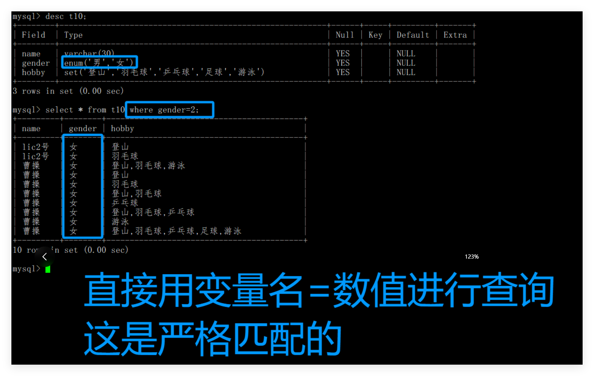
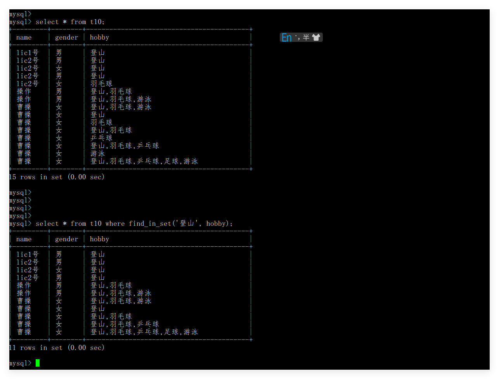

# sql笔记


## 2.库的操作

**2.1字符集和校验集**

**查看字符集：**

```mysql
show charset
```

**查看检验集:**

```mysql
show collation
```

**查看默认的字符集：**

```mysql
show  variables like 'character_set_database';
```

**查看默认的校验集:**

```mysql
show variables like 'collation_database';
```


**2.2创建和删除**

**创建数据库：**

```mysql
create database d1 character set utf8mb4 collate utf8mb4_general_ci;
```

**数据库最重要的就是字符集和校验集。**

**UTF-8 Multi-Byte 4-Byte General Case-Insensitive Collation**

**Unicode Transformation Format - 8-bit**


**删除数据库：**

```mysql
drop database d1;
```

**2.3数据库的查看**

**查看数据库的个数：**

```mysql
show databases;
```

**查看如何创建数据库：**

```mysql
show create database d1;
```

**使用数据库：**

```mysql
use d1;
```

**查看链接数**

```mysql
show processlist;
```


## 3.表的操作

**3.1创建表和删除表：**

**创建表：**

```mysql
create table users2 ( 
id int comment '序号', 
name varchar(20) comment '名称',  
passwd char(32)  comment '密码',  
birthday date comment '生日'  ) character set utf8mb4 collate utf8mb4_general_ci engine InnoDB;
```

**表的：字符集，校验集，存储引擎。**

**删除表：**

```mysql
drop table users2;
```


**3.2查看表：**

**表的逻辑结构：**

```mysql
desc users2;
```

**表的创建语句：**

```mysql
show create table users2 \G
```


**3.3表的性质修改：**

**修改表的名称：**

```mysql
alter table users2 rename to user
```

**增加一列属性：**

```mysql
alter table user add image_path varchar(30) comment '用户头像';
```

**删除一列属性：**

```mysql
alter table user drop id;
```

**修改属性：**

```mysql
alter table user modify name int;
```

```mysql
alter table user change name xingming varchar(30);
```

**总结：**

```mysql
alter table tb_name 
rename to  // 新名称
add        // 添加新的一行
drop       // 删除一行
modify     // 修改属性，列名称不变
change     // 修改名字和属性
```

**查看表的操作**

```mysql
desc tb_name;
show create table tb_name \G
show tb_name;
```


## 4.数据类型

**4.1整型**

| **类型**        | **存储空间** |              **有符号范围** |    **无符号范围** |
| --------------- | -----------: | --------------------------: | ----------------: |
| **`TINYINT`**   |   **1 字节** |               **-128～127** |        **0～255** |
| **`SMALLINT`**  |   **2 字节** |           **-32768～32767** |      **0～65535** |
| **`MEDIUMINT`** |   **3 字节** |       **-8388608～8388607** |   **0～16777215** |
| **`INT`**       |   **4 字节** | **-2147483648～2147483647** | **0～4294967295** |
| **`BIGINT`**    |   **8 字节** |             **-2⁶³～2⁶³-1** |      **0～2⁶⁴-1** |

**默认是有符号的。 可以指定为无符号的。**

**mysql：中数据类型也是一种约束的。**

**mysql中： 变量名 ： 类型**

```mysql
create table t11(
    t1 tinyint,
    t2 tinyint unsigned);
```


**bit[(M)] : 位字段类型。M表示每个值的位数，范围从1到64。如果M被忽略，默认为1。**


**4.2浮点型**

| 类型               | 占用空间               | 数值性质   | 大约有效精度                         |
| ------------------ | ---------------------- | ---------- | ------------------------------------ |
| **`FLOAT`**        | **4 字节**             | **近似值** | **约 6～7 位十进制有效数字**         |
| **`DOUBLE`**       | **8 字节**             | **近似值** | **约 15～16 位十进制有效数字**       |
| **`DECIMAL(M,D)`** | **根据 `M`、`D` 决定** | **精确值** | **由 `M` 决定，最多保存 `M` 位数字** |

**注意:浮点型会四舍五入的。**

**四舍五入也不能超过范围的。**


**4.3字符型**

**char和varchar类型。**

| 对比项           | `CHAR(M)`                        | `VARCHAR(M)`                       |
| ---------------- | -------------------------------- | ---------------------------------- |
| **长度性质**     | **固定长度**                     | **可变长度**                       |
| **`M` 的含义**   | **最多存储 M 个字符**            | **最多存储 M 个字符**              |
| **长度范围**     | **0～255 个字符**                | **理论上 0～65535 个字符**         |
| **存储空间**     | **按声明长度处理，不足时补空格** | **按实际内容长度存储**             |
| **额外长度信息** | **通常不需要记录实际长度**       | **额外使用 1 或 2 字节记录长度**   |
| **尾部空格**     | **存储时补空格，查询时通常删除** | **不自动补空格，尾部空格通常保留** |
| **适合的数据**   | **长度基本固定**                 | **长度变化较大**                   |

**char存储的是字符：就是我们实际看到的字符样子。0-255之间的**

**varchar存储的底层是： 65535个字节，所以存储的字符个数还需要和编码信息统一，而且底层还有存储的容量计数的。**


**4.4日期类型**

| 类型            | 标准格式                  | 占用空间   | 主要范围                   | 常见用途                         |
| --------------- | ------------------------- | ---------- | -------------------------- | -------------------------------- |
| **`YEAR`**      | **`YYYY`**                | **1 字节** | **1901～2155，以及 0000**  | **出生年份、生产年份**           |
| **`DATE`**      | **`YYYY-MM-DD`**          | **3 字节** | **1000-01-01～9999-12-31** | **生日、入职日期、订单日期**     |
| **`TIME`**      | **`HH:MM:SS`**            | **3 字节** | **-838:59:59～838:59:59**  | **时刻、持续时间、时间间隔**     |
| **`DATETIME`**  | **`YYYY-MM-DD HH:MM:SS`** | **5 字节** | **1000-01-01～9999-12-31** | **业务日期时间、预约时间**       |
| **`TIMESTAMP`** | **`YYYY-MM-DD HH:MM:SS`** | **4 字节** | **1970-01-01～2038-01-19** | **创建时间、更新时间、日志时间** |

**date, datetime。需要程序员自己插入，插入需要安装字符串的格式进程插入的。**

**timestamp。时间戳，每一次操作数据库，会形成一个时间戳的。**


**4.5枚举和集合**

**enum('选项1','选项2','选项3',...);**

​	**insert的时候，可以直接插入1, 2，3 ....就是对应的选项了。枚举只能选择一个的。**

**set('选项值1','选项值2','选项值3', ...);**

​	**insert的时候，可以直接插入数字， 0-2^n-1次方的数字。  注意从左往右的数字。**

**mysql的字段进行比较的时候，都是严格的匹配的**



**find_in_set函数的使用。**




## 5约束

**5.1 非空约束**

**null表示什么都没有的，null不参与计算的。注意null和空白字符的区别的。**

**not null 非空的。**


**5.2 默认值**

**default: 设置了，用户的数据存在了，就用用户的，不存在就用自己的。**

**default 和 not null不冲突的。 **

**mysql默认是null的。这是mysql的优化的。**


**5.3 描述列。**

**相当于语言的注释。comment '注释的信息'。**

**列描述：comment，没有实际含义，专门用来描述字段，会根据表创建语句保存，用来给程序员或DBA 来进行了解。**


**5.4 zerofill**

**零填充约束。**

**显示方面的约束**

**`ZEROFILL` 是 MySQL 早期用于数字格式化显示的修饰符，它会根据显示宽度在数字左侧补零，并自动添加 `UNSIGNED` 属性。**

**它不会改变数据的实际存储值和存储空间，只影响查询显示效果。**

**从 MySQL 8.0.17 开始已被官方弃用，实际开发中通常使用 `LPAD()` 或由应用程序完成补零格式化。**

**hex()  转换成16进制的。**


